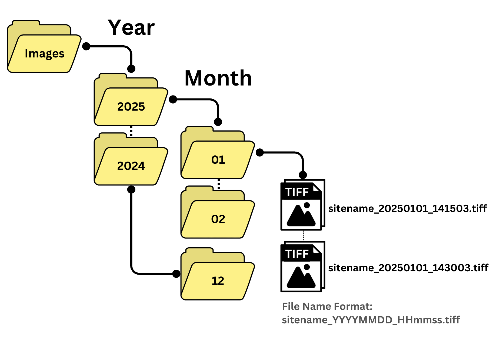
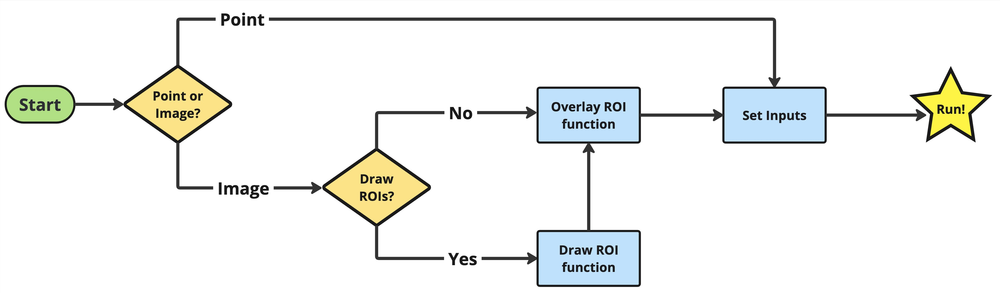

<br><br>  <!-- Adds vertical space -->

# correcTIR

&nbsp;  <!-- Adds an empty space to create separation -->

Last Updated: May 16, 2025
## Python Package & GUI Documentation


### How to cite this package

>Placeholder


* [Overview](#overview)
* [Set-Up](#set-up)
* [Python Package](#python-package)
* [GUI](#GUI)
  * [Windows](#windows)
  * [MacOS](#macos)
  * [Linux](#linux) 
* [Requirements](#Requirements)
* [Output](#output-file)
* [Example Use](#Example-Use)
  * [Images](#images)
  * [Point](#point)
* [Additional Features](#Additional-Features)
* [Troubleshooting & FAQs](#Troubleshooting--FAQs)
* [Feedback](#feedback)

## Overview

correcTIR enhances the consistency and reliability of thermal measurements by standardizing the near-surface thermal data post-processing workflow. The GUI is designed to help new users swiftly process temperature data, while the Python package provides comprehensive customization options for more experienced users. correcTIR is capable of handling thermal data both as images (stored in .tiff format) and as point measurements (stored in .csv format with each entry as a row), with temperature values in degrees Celsius.

For detailed file formatting and setup instructions, see the [Set-Up](#set-up) section below.  
To learn more about the overall pipeline workflow, refer to [Pipeline Workflow](PipelineWorkflow.md).  
For specific function details, check the [Function Reference](Function_Reference.md).

The development of correcTIR is grounded in rigorous thermal theory, aiming to address the common challenges in thermal data accuracy and utility. For a comprehensive explanation of the theoretical foundations and expanded details on the functionalities of correcTIR, please consult:

>Placeholder for my paper

>Aubrecht, D. M., Helliker, B. R., Goulden, M. L., Roberts, D. A., Still, C. J., & Richardson, A. D. (2016). Continuous, long-term, high-frequency thermal imaging of vegetation: Uncertainties and recommended best practices. Agricultural and Forest Meteorology, 228–229, 315–326. https://doi.org/10.1016/j.agrformet.2016.07.017

>Johnston, M. R., Andreu, A., Verfaillie, J., Baldocchi, D., González-Dugo, M. P., & Moorcroft, P. R. (2021). Measuring surface temperatures in a woodland savanna: Opportunities and challenges of thermal imaging in an open-canopy ecosystem. Agricultural and Forest Meteorology, 310, 108484. https://doi.org/10.1016/j.agrformet.2021.108484


## Set-Up

To ensure smooth use of correcTIR, your input data must follow specific structures. Below are the key requirements. Blank templates are available in the **"Template"** folder. For practical examples and additional guidance, see [Example Use](#example-use) section and **"Test Data"** folder.

For image-based processing, you will need:

✅ [Correct image folder structure and naming](#image-folder-structure--naming)

✅ [Auxiliary data](#auxiliary-data-files) (1 or 2 files, depending on measurement interval)

✅ [Distance data](#distance-data-file) (either a pixel distance or an average distance file)

✅ [Region of Interest (ROI) file](#region-of-interest-roi-file)

📌 Total: 3–4 files

For point-based processing, you will need:

✅ [Point data](#point-data)

✅ [Auxiliary data](#auxiliary-data-files) (1 or 2 files, depending on measurement interval)

📌 Total: 2–3 files

⏳ Timezone: Your data must include a timestamp field in the required format to properly align images and point measurements. However, any timezone is acceptable as long as it is applied consistently across all input files. We recommend using local time.

🚀 Once your input data is in the correct format, you are ready to run the pipeline! You can now jump to the [Configuration File](#configuration-file) section to set up your processing for both Python package and GUI usage.

_Note: correcTIR is optimized for handling data from individual sites one at a time._

### Image Folder Structure & Naming

* Organize your thermal image measurements using the following folder structure for proper functioning:
  
Images/ Year/ Month/
  
**Example:** Images/ 2023/ 10/
  
* Each image should follow this naming convention:
  
sitename_YYYYMMDD_HHmmss.tiff

_Note: HHmmss can be in any timezone as long as it is applied consistently across all input files._

**Example:** NIWOT_20211002_141503.tiff
  
<figure>
    
</figure>

### Point Data

* Organize your thermal point measurements using the following file structure for proper functioning:
  
  | timestamp      | temp_value      |
  |----------------|-----------------|
  | 1/16/17 14:30  | -5.1133         |
  | 1/16/17 14:45  | -5.1454         |
  | ...            | ...             |
  
**Column Descriptions:**

timestamp: Represents the date and time of the recorded measurement in MM/DD/YY HH:mm format. This timestamp uses the 24-hour time notation, where '14:30' indicates 2:30 PM. Any timezone is acceptable as long as it is applied consistently across all input files.
  
temp_value: Temperature measurements in degrees Celsius.

### Auxiliary Data File(s)

Processing thermal data requires additional environmental data, ideally collected at the same time interval as the thermal measurements. To align these datasets, you can specify a search window (in minutes), which defines how far forward in time the system will look to find the closest available auxiliary data point that matches each thermal data timestamp. If no auxiliary data point is found within the specified search window, the corresponding thermal measurement will not be processed. This ensures that only thermal data with valid environmental context are included in the analysis. See the [Example Use](#example-use) section for details.

| TIMESTAMP_END     | T_air    | RH      | LW_IN   | VF_2    | T_win   |
|-------------------|----------|---------|---------|---------|---------|
| 8/30/17 14:35     | 14.33781 | 32.02635| 256.20  | 14.33781|14.33781|
| 8/30/17 14:40     | 14.43806 | 31.93127| 255.05  |14.43806 |14.43806 |
| ...               | ...      | ...     | ...     | ...     | ...     |

**Column Descriptions:**

_Note: The order of the columns does not impact processing. Additional columns can be included in the dataset as long as the required columns are present and correctly labeled._

TIMESTAMP_END: Represents the end date and time of the recorded measurement in MM/DD/YY HH:mm format. This timestamp uses the 24-hour time notation, where '14:35' indicates 2:35 PM. Any timezone is acceptable as long as it is applied consistently across all input files.
  
T_air: Air temperature measurements in degrees Celsius.

RH: Relative humidity measurements in float percent (%).

LW_IN: Incoming longwave radiation measurements in W/m².

VF_2: Surrounding temperature measurements in degrees Celsius. _(If air temperature is used as a proxy, duplicate the ‘T_air’ column under the ‘VF_2’ header for processing.)_

T_win: Enclosure window temperature measurements in degrees Celsius. _(If air temperature is used as a proxy, duplicate the ‘T_air’ column under the ‘T_win’ header for processing.)_


_Note: The software supports reading multiple auxiliary files when variables are recorded at different time intervals. For example:_

_* File 1 - Incoming longwave radiation averaged over 30-minute intervals from a flux tower._

_* File 2 - Air temperature, relative humidity, view factor 2, and window temperature recorded at 5-minute intervals._

_To accommodate such cases, you can provide the software with two separate auxiliary files. You can find blank templates in the Template folder._

### Distance Data File

_This file is **not** required if you're processing point-based measurements._

For image-based processing, the distance between the temperature measurement instrument and the region(s) of interest must be specified. You can provide this information using one of two methods:

* Point Cloud Projection: For more precise distance corrections, you can supply a point distance (.csv) containing the distance **(in meters)** of each pixel from the camera within its field of view (FOV). For guidance on how to make this distance map using structure from motion, see Aubrecht et al. (2016).

Example: If your thermal camera has a resolution of 480 × 640 pixels, your point cloud .csv should contain 480 rows and 640 columns, with each cell representing the distance (in meters) from the camera to that pixel. Example files can be found in the "Test Data" folder. 

* Average Distance(s): Alternatively, you can manually enter the average distance(s) for each region of interest.
  
| label   | average_distance |
|---------|------------------|
| F1      | 28.56            |
| S1      | 18.31            |
| ...     | ...              |

**Column Descriptions:**

label: A unique identifier for the region of interest. This label must be consistent across all processing steps and should match the label used for the Region of Interest (ROI) file in image processing.
  
average_distance: Average distance from the camera to specified region of interest in meters.
  
### Region of Interest (ROI) File

_This file is **not** required if you're processing point-based measurements._

The ROI file defines regions of interest (ROIs) within thermal image datasets. If the camera is shifted or moved, the ROIs must be updated to ensure accurate analysis. You can draw ROIs manually using the GUI (Draw ROI button in the Image Processing section) and in Python, use the function draw_and_label_poly_rois from the package. For additional ROI functions, such as saving an image with overlaid ROIs, see [Additional Features](#additional-features) section. 

| Label  | Point_1_x  | Point_1_y  | Point_2_x  | Point_2_y  | Point_3_x  | Point_3_y  | ...      | Point_X_x  | Point_X_y  |
|--------|------------|------------|------------|------------|------------|------------|----------|------------|------------|
| F1     | 298        | 231        | 294        | 247        | 299        | 279        |          |            |            |
| S1     | 287        | 244        | 283        | 284        | 289        | 312        |          |            |            |
| ...    | ...        | ...        | ...        | ...        | ...        | ...        | ...      | ...        | ...        |

**Column Descriptions:**

Label: A unique identifier for the region of interest. This label must be consistent across all processing steps and should match the label used for the Average Distance file if using.
  
Point_1_x, Point_1_y: The x- and y-coordinates (in pixels) of the first point defining the ROI.

Additional Points: Each ROI consists of multiple points, with repeating Point_X_x, Point_X_y columns for however many points define the region.

The .csv file should start with a header row specifying the label and then pairs of x and y coordinates. Each subsequent row defines a labeled ROI with its set of coordinates.

### Configuration File

Now that your input files are in the correct format, you are ready to run the processing pipeline. The workflow for both the Python package and the GUI is illustrated below:
<figure>
    
</figure>

Users must specify all required inputs in a JSON configuration file, which guides the pipeline and serves as a record of the applied parameters. This can be done in two ways:
•	Python Package: Requires manual creation and editing of the JSON file with precise formatting.
•	GUI: Provides a guided interface for creating the JSON configuration file correctly.

The table below outlines each input parameter, including its description and whether it applies to image or point processing. Properly configured example files are available in the "Test Data" folder. See the [Example Use](#example-use) section to replicate the setup.

_Note: The order of the inputs does not impact processing as long as the required input fields are present and correctly labeled. No additional parameters should be present._

Once the .json file is created, you're ready to process your point data!

| Parameter            | Description                                                                                                                                                         | Format                     | Used for     |
|----------------------|---------------------------------------------------------------------------------------------------------------------------------------------------------------------|----------------------------|--------------|
| data                 | Specifies the type of data being processed (image or point).                                                                                                       | "image" / "point"          | Image, Point |
| aux_met_data_path    | Path to .csv with auxiliary meteorological data (air temp, RH, LWd, etc.).                                                                                         | string (file path)         | Image, Point |
| aux_met_window       | Search window in minutes to match auxiliary data with thermal measurement.                                                                                         | integer (minutes)          | Image, Point |
| flux_met_data_path   | Optional path to .csv with flux data (e.g., LWd). Allows multiple files.                                                                                           | string (file path)         | Image, Point |
| flux_met_window      | Search window for flux data matching, optional.                                                                                                                    | integer (minutes)          | Image, Point |
| sky_percent          | Percentage of view factor exposed to sky (0–100). Set to 100 if target is only exposed to sky.                                                                                                                  | integer (0–100)            | Image, Point |
| emissivity_vf2       | Emissivity of non-sky surroundings (e.g., structures). Set to 1 if target is only exposed to sky.                                                                                                             | float (0–1)                | Image, Point |
| UTC_offset           | Timezone offset from UTC, in hours (e.g., -7.0 for MST).                                                                                                            | float                      | Image, Point |
| emissivity_target    | Emissivity of the target object.                                                                                                                                   | float (0–1)                | Image, Point |
| elevation            | Site elevation used for water vapor density correction.                                                                                                            | float (meters)             | Image, Point |
| win_transmittance    | Transmittance of enclosure window. Set to 1 if no enclosure is used.                                                                                               | float (0–1)                | Image, Point |
| roi_path             | Path to .csv with ROI masks for image-based processing.                                                                                                            | string (file path)         | Image        |
| roi_dist_path        | Path to .csv with ROI distance data (average or pixel distance).                                                                                                      | string (file path)         | Image        |
| img_dist_type        | Specifies ROI distance type ("pixel distance" or "average").                                                                                                          | "pixeldistance" / "average"  | Image        |
| first_image_path     | Path to representative .tiff image for extracting image shape.                                                                                                     | string (file path)         | Image        |
| base_folder          | Path to base image folder containing all TIR data.                                                                                                                 | string (directory path)    | Image        |
| point_data_path      | Path to .csv containing raw point-based thermal data.                                                                                                              | string (file path)         | Point        |
| point_dist           | Fixed distance from sensor to target for point data.                                                                                                               | float (meters)             | Point        |
| output_csv_path      | File path for storing the output .csv (auto-created).                                                                                                              | string (file path)         | Image, Point |

## Python Package

For users who want to run individual functions or the full pipeline in Python, the correcTIR package can be downloaded, installed, and executed as follows:

### Installation

1. Clone the Repository

To download the latest version of the repository, open a terminal or command prompt and run:

```
git clone [[https://github.com/Thermal-Cam-Network/TIRPost.git](https://github.com/Thermal-Cam-Network/TIRPost.git)](https://github.com/jdiehll/correcTIR.git)
```
If you don’t have Git installed, you can download the repository manually by clicking Code → Download ZIP on GitHub and extracting the contents.

2. Navigate into the Cloned Directory

Move into the project folder:

```
cd correcTIR
```

3. Create and Activate a Virtual Environment (Recommended)

To create a virtual environment:
```
python -m venv /path/to/new/virtual/environment
```
_Note it may be necessary to type python3 and not just python._

For instructions on creating a Conda environment, refer to the [conda documentation](https://conda.io/projects/conda/en/latest/user-guide/tasks/manage-environments.html). 

Once the virtual environment is created, install all required correcTIR dependencies (see [Requirements](#requirements) section). 

4. Pull the Latest Updates (Optional but Recommended)
To update your local copy of the repository:
```
git pull origin main
```

### Running the Processing Pipeline

To successfully run the correcTIR package, follow these steps:

1. Prepare Your Files
* Ensure all required files are in the correct format, naming convention, and folder structure.
* Create a JSON configuration file named config.json, customized with your input settings. Save this file in the root correcTIR folder (the same folder that contains main.py).
* Make sure all correcTIR dependencies are installed (see [Requirements](#requirements) section).
_Tip: We recommend working within a virtual environment to avoid package conflicts._

2. Navigate to the Project Folder
Open your terminal and move into the project directory:
```
cd correcTIR
```

3. Run the Processing Pipeline
Execute the package using:
```
python main.py
```
_Note: On some systems, you may need to use python3 instead of python._

This will initiate data processing using the parameters defined in your config.json.

4. Track Progress
A pop-up window will appear showing real-time progress, including how many images have been processed out of the total. This helps you monitor the pipeline’s execution.

5. Errors
If any errors occur, they will be printed to the terminal with detailed messages when available. Use this output to troubleshoot issues with your configuration or input data.

6. Completion
When processing finishes and the progress bar reaches 100%, you can close the pop-up window. Your processed output files will now be available for review in the designated output directory.

### Running Individual Functions

In addition to running the full correcTIR processing pipeline, you can also call individual functions from the Python package for custom workflows.

To do this, simply import and run the desired function in your Python script or interactive session.

Example: Converting Radiance to Temperature
```
import sys
sys.path.append('/path/to/correcTIR_parent_folder')

from correcTIR.Main_Functions import radiance_to_temp

radiance_to_temp(radiance)
```

Example: Calculating Atmospheric Transmittance
```
import sys
sys.path.append('/path/to/correcTIR_parent_folder')

from correcTIR.Main_Functions import atm_trans

atm_trans (dist, rho_v)
```
_Note: Replace the arguments with your data or variables as needed._

For a full list of available functions and their required arguments, refer to the [Function Reference](Function_Reference.md).

## GUI
For users who prefer a graphical user interface (GUI), the correcTIR GUI is available as a pre-compiled application for the three most commonly used operating systems. The GUI is designed exclusively for running the entire processing pipeline—it does not support running individual functions separately. The GUI walks users through all necessary inputs, generates a config.json file, and then runs the pipeline. For more details, see [Example Use](#example-use) section.

_Note: correcTIR is not available on mobile devices (Android, iPhone)._

Regardless of the OS used either a Conda or Python virtual environment is recommended. Without a virtual environemt or Conda environment pyinstaller may not be available unless added to the path variable. 

Creating a virtual environment. Note it may be necessary to type python3 and not just python.
```
python -m venv /path/to/new/virtual/environment
```

To create a conda environment see the [conda documentation](https://conda.io/projects/conda/en/latest/user-guide/tasks/manage-environments.html). 

Once a virtual environment is created install all of the TIR dependencies see [Requirements](#requirements) section. Run the following based on your OS in the terminal.

### Windows
```
pyinstaller --windowed --onedir  .\correcTIR.py
```

### MacOS
```
pyinstaller -w --noupx --onedir correcTIR.py
```

### Linux
```bash
pyinstaller --windowed --onedir correcTIR.py
```

## Requirements

The following requirements can be installed by running. 
_Note: Some packages may be downgraded on your system which is why having a virtual environemnt is key._

```
pip install -r requirements.txt
```

```
geopandas==1.0.1
matplotlib==3.9.1.post1
numpy==2.0.1
opencv-python==4.10.0.84
pandas==2.2.2
pillow==10.4.0
pyinstaller==6.10.0
ttkbootstrap==1.10.1
```

### Output File

Processed results are saved to a '.csv' file (output_csv_path), with each row representing a successfully matched and processed entry. Columns include associated meteorological data and thermal readings from raw to fully corrected temperatures.

### Images

| Column Header   | Description                                                                                 |
|-----------------|---------------------------------------------------------------------------------------------|
| filepath        | The complete file path where the original TIFF image is stored.                            |
| filename_short  | A shortened or more convenient representation of the image file name.                      |
| Timestamp       | The date and time when the data were recorded, formatted as MM/DD/YY HH:MM.                |
| T_air           | Air temperature at the time of image capture, measured in °C.                              |
| RH              | Relative humidity at the time of data capture, expressed as a percentage.                  |
| sky_temp        | Temperature of the sky, from LW_IN, measured in °C.                                        |
| VF_2            | Temperature of view factor 2, measured in °C.                                              |
| T_win           | Temperature of enclosure window, measured in °C.                                           |
| LW_IN           | Longwave incoming radiation measured in W/m².                                              |
| rho_v           | Water vapor density in the air, measured in g/m³.                                          |
| tau             | Atmospheric transmittance.                                                                 |


For each Region of Interest (ROI_X), the following values are computed as additional columns in output .csv file:

| Column Header                   | Description                                                                                   |
|--------------------------------|-----------------------------------------------------------------------------------------------|
| ROI_X_{stat}_uncorrected       | Uncorrected thermal reading for {stat} (mean or percentile).                                 |
| ROI_X_{stat}_fully_corrected   | Fully corrected thermal reading for {stat}.                                                   |
| ROI_X_{stat}_tau1              | Thermal reading for {stat} with atmospheric corrections turned off.                           |
| ROI_X_{stat}_twin1             | Thermal reading for {stat} with enclosure window corrections turned off.                      |
| ROI_X_{stat}_emiss1            | Thermal reading for {stat} with reflected radiation corrections turned off.                   |


where {stat} represents one of the following statistical measures:

* mean: Mean value
* p1: 1st percentile
* p5: 5th percentile
* p10: 10th percentile
* p25: 25th percentile
* p50: 50th percentile (median)
* p75: 75th percentile
* p90: 90th percentile
* p95: 95th percentile
* p99: 99th percentile

These values are repeated for all available ROIs in the dataset.

### Points

| Column Header               | Description                                                                                      |
|----------------------------|--------------------------------------------------------------------------------------------------|
| Timestamp                  | The date and time when the data were recorded, formatted as MM/DD/YY HH:MM.                      |
| T_air                      | Air temperature at the time of image capture, measured in °C.                                    |
| RH                         | Relative humidity at the time of data capture, expressed as a percentage.                        |
| sky_temp                   | Temperature of the sky, inferred from the image, measured in °C.                                 |
| LW_IN                      | Longwave incoming radiation measured in W/m².                                                    |
| rho_v                      | Water vapor density in the air, measured in g/m³.                                                |
| tau                        | Atmospheric transmittance.                                                                       |
| temp_value_uncorrected     | Uncorrected thermal reading.                                                                     |
| temp_value_fully_corrected| Fully corrected thermal reading.                                                                  |
| temp_value_tau1            | Corrected thermal reading if atmospheric corrections are turned off.                             |
| temp_value_twin1           | Corrected thermal reading if enclosure window corrections are turned off.                        |
| temp_value_emiss1          | Corrected thermal reading if reflected radiation is turned off.                                  |

## Example Use
I'm not exactly sure what this should look like. A video of me moving through the GUI?

## Additional Features

**Draw & Label ROI(s)**

The draw_and_label_poly_rois() function allows users to interactively draw and label polygonal Regions of Interest (ROIs) on a thermal image and optionally save them to a .csv file. This tool is useful for defining spatial zones for later analysis or correction.

Function: draw_and_label_poly_rois(image_path, output_csv_path=None)
Input Parameters:
- image_path (str): Path to the thermal .tiff image on which to draw ROIs.
- output_csv_path (str, optional): Full path (including filename) where the labeled ROIs will be saved as a .csv file. If not provided, ROIs will not be saved automatically.
_**Note: After drawing each polygon, a pop-up prompt will appear asking you to enter a label for the ROI. You must name the ROI before you can begin drawing the next one.**_

Function: save_rois_to_csv(rois, filename="rois.csv")
If you choose not to save during ROI drawing, you can use this function afterward to save the ROI list to a .csv.
Input Parameters:
- rois (list): A list of labeled polygon ROI dictionaries as returned by draw_and_label_poly_rois().
- filename (str, optional): File path where the .csv should be saved. Defaults to "rois.csv" in the current directory.

```
import sys
sys.path.append('path/to/package/correcTIR')

from correcTIR.ROI_Viz_Functions import draw_and_label_poly_rois, save_rois_to_csv

# Define input and output paths
image_path = 'path/to/tiff/thermal/image.tiff'
output_path = 'path/to/save/rois.csv'

# Launch interactive tool to draw ROIs and save to CSV
rois = draw_and_label_poly_rois(image_path, output_csv_path=output_path)

# Alternatively, save later using:
# save_rois_to_csv(rois, filename=output_path)
```

**Checking ROI overlay is correct and option to save image with ROIs**

The overlay_rois_from_csv() function allows you to visualize previously labeled ROIs by drawing them on top of a thermal image. You can optionally save the result as a new image.

Function:
overlay_rois_from_csv(image_path, csv_path, output_image_path=None)
Input Parameters:
- image_path (str): Path to the thermal .tiff image on which to overlay ROIs.
- csv_path (str): Path to the .csv file containing ROI labels and coordinates.output_image_path (str, optional): Path to save the image with overlaid ROIs. If not specified, the image is displayed in a pop-up window with instructions.

```
import sys
sys.path.append('path/to/package/correcTIR')

from correcTIR.ROI_Viz_Functions import overlay_rois_from_csv

# Define paths
image_path = 'path/to/tiff/thermal/image.tiff'
roi_path = 'path/to/rois.csv'

# Optional: define path to save image with ROIs
save_path = 'path/to/save/overlay_image_with_rois.jpg'

# Overlay and optionally save the image
overlay_rois_from_csv(image_path, roi_path, output_image_path=save_path)
```
_Note: If output_image_path is not provided, a pop-up window will display the image. Press 'x' to close the window when you're done reviewing._

**Saving thermal image without ROIs**

The save_thermal_image() function generates a visually enhanced image from a raw thermal .tiff by applying a colormap and including a temperature colorbar. This is useful for creating publication-quality figures or verifying temperature gradients visually.

Function:
save_thermal_image(tiff_path, save_path, colormap='inferno')
Input Parameters:
- tiff_path (str): Path to the input thermal .tiff image.
- save_path (str): Path to save the output .png image that includes both the color-mapped thermal image and an adjacent temperature colorbar.
- colormap (str, optional): The colormap to apply (default: 'inferno'). Any valid matplotlib colormap name can be used (e.g., 'plasma', 'viridis', 'jet', etc.).

```
import sys
sys.path.append('path/to/package/correcTIR')

from correcTIR.ROI_Viz_Functions import save_thermal_image

tiff_path = 'path/to/raw/thermal_image.tiff'
save_path = 'path/to/output_colormapped_image.png'

save_thermal_image(tiff_path, save_path, colormap='inferno')
```

**.seq files to .tiff files**

This process converts raw thermal images from .seq format into temperature-calibrated .tiff files for further analysis.
_Need to download exiftool and have it installed on computer @ https://exiftool.org/_

Assumes you have a folder for each month and running one year at a time.

1.  Update SEQ_Reformatting.ipynb with Your Paths
Open the script and update the following two directory paths:
```
base_dir = 'path/to/seq/image/folders'  # Path to raw .seq image folder  
output_base_dir = 'path/to/save/tiff/images'  # Path to save .tiff output files  
```
2. Run the Conversion Script
You can run SEQ_Reformatting.ipynb in any Python environment.
  
## Troubleshooting & FAQs

**I Don't Have All or Any of the Appropriate Auxiliary Data**

While it is best practice to collect auxiliary data near your temperature measurement instrument, we understand this is not always feasible.

In such cases, we recommend using ERA5-Land Hourly - ECMWF Climate Reanalysis reanalysis datasets for your site location and formatting them to match our required file structure. _Note: Make sure your search window is extended to capture this hourly dataset._
 
Platforms like Google Earth Engine can help retrieve relevant environmental data. An example of how to do this with Google can be found at this [link](https://code.earthengine.google.com/d5a4a985acef29b283d50e8dccaf0054).

> Muñoz Sabater, J., (2019): ERA5-Land monthly averaged data from 1981 to present. Copernicus Climate Change Service (C3S) Climate Data Store (CDS). (date of access), doi:10.24381/cds.68d2bb30

**My Output .csv Came Back Blank**

If your output file is empty, check the following troubleshooting steps:

  * Does your search window include the data?

Ensure that the time window you specified for matching thermal and auxiliary data actually contains valid data points.

  * Is your data in the correct timestamp format?

Confirm that timestamps match the expected format (e.g., YYYY-MM-DD HH:MM:SS).
Check for any timezone mismatches that might cause data misalignment.

  * Is your data in the correct number format?

Ensure numerical values are stored correctly (e.g., no missing values, text-formatted numbers, or decimal inconsistencies).
Check for unintended special characters (e.g., commas, spaces) that might interfere with parsing.

## Feedback
For inquiries, suggestions, or feedback, please contact the author at jdiehl@nau.edu.
